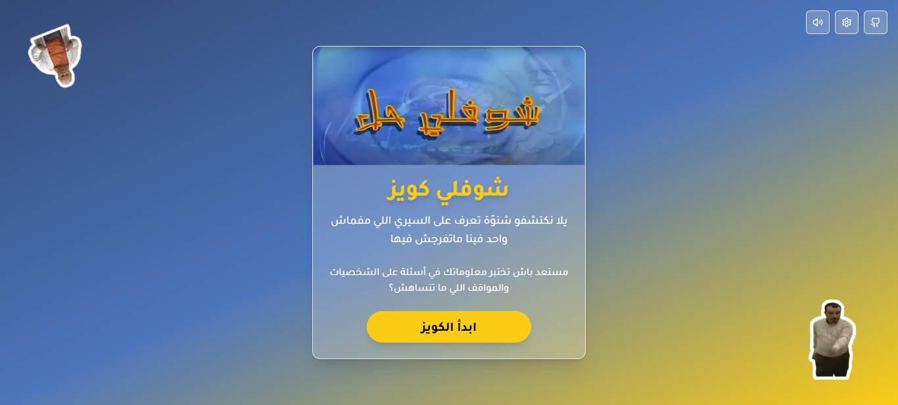
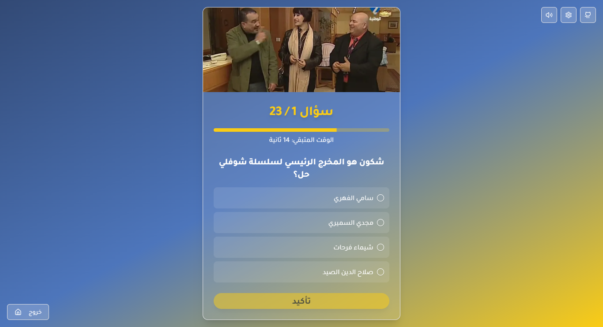

# Choufli Hal Quiz 🎭

Experience the laughter and nostalgia of Tunisia's beloved comedy series, *Choufli Hal*, through this interactive and engaging quiz app! Test how well you know the series and challenge your friends to join the fun.

---

## 🌟 Features
- **Engaging Quizzes**: Dive into questions inspired by *Choufli Hal* episodes, characters, and iconic moments.  
- **Dynamic UI**: Enjoy a smooth and modern user experience powered by Next.js and ShadCN components.  
- **Responsive Design**: Play on any device—mobile, tablet, or desktop.  
- **Fast & Secure**: Deployed on Vercel for lightning-speed performance and reliability.  

---

## 🖥️ Demo  
Check out the live version here: [Choufli Hal Quiz](https://choufli-quiz.vercel.app)

---

## 📸 Screenshots  
  
*Explore the sleek, Tunisian-themed homepage.*  

  
*Answer fun questions and unlock your inner *Choufli Hal* superfan.*  

---

## 🚀 Technologies Used  
- **Framework**: [Next.js](https://nextjs.org/) with app routing  
- **UI Library**: ShadCN  
- **Deployment**: [Vercel](https://vercel.com/)  

---

## 🤝 Contributing  
Feel free to fork the repository and submit pull requests for improvements or new features!

---

## 📝 License  
This project is licensed under the MIT License. See the LICENSE file for details.

---

## 💡 Inspiration  
*Choufli Hal Quiz* is a tribute to the timeless humor of Tunisia's most iconic sitcom. It’s built to share the joy and memories of this masterpiece with fans everywhere!

---

### 👩‍💻 Developed by: [Chayma Farhat](https://chaymafarhat.vercel.app)
